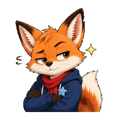
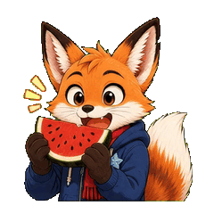
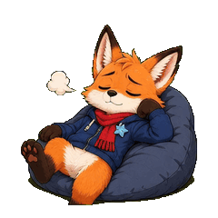
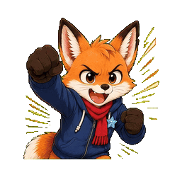
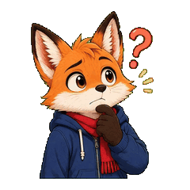
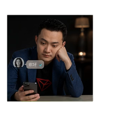
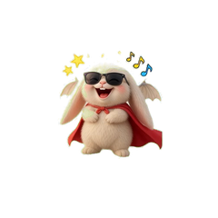

# Motion Sticker Pack

[](https://github.com/kobingogo/motion-sticker-pack/actions/workflows/ci.yml)
[中文](README.md) · [MIT](LICENSE) · [Release notes](RELEASE_NOTES.md)

Turn one character image—or a text-defined character—into a reviewed, auditable, looping animated sticker pack.

`motion-sticker-pack` is an Agent Skill for Codex. The default delivery contains transparent PNG, lossless Animated WebP, compatibility GIF, processing reports, and one ZIP. Normal use is conversational; users do not need to run Python commands.

## Start in 30 seconds

Install the Skill, attach a character image, and send:

```text
$motion-sticker-pack
Create a 3×3 animated sticker pack from the attached character.
Use soft-plush. Reactions: happy, love, upset, surprised, kiss, thanks, cheer, sleepy, like.
Show me the static sheet first. Continue only after I approve it.
Keep every motion small, independent, and loopable.
```

A text description works too. The workflow generates the complete sheet directly instead of creating an unnecessary intermediate character image.

The interaction is:

1. Provide an image or character description.
2. Choose a style and reactions.
3. Review the detected static grid.
4. Explicitly approve it.
5. Use the best available motion route.
6. Download WebP/GIF/PNG and ZIP.

## Three motion tiers

| Tier | Route | Result and cost |
|---|---|---|
| AI video | `native-video`, Grok, xAI, Kling, Seedance, Wan, FAL | Articulated face/body motion; may incur provider cost |
| Real key poses | `keypose-local` | Image generation creates anticipation/peak/recovery poses; local deterministic assembly |
| Light motion | `light-motion-local` | Zero generation cost; small affine loops only, with no articulated-motion claim |

`transform-local` and `keyframe-local` remain accepted as deprecated configuration aliases. New routes emit `light-motion-local`.

When no video or local image processing is callable, `prompt-only` delivers prompts and audit files without pretending media was generated.

## Recent animated sticker example

The latest completed pack is “Warm-Tail Fox”: nine independent reactions, each kept as an original 240×240, 8 fps, 3-second looping GIF after alpha, boundary, and encoded-frame checks. See [`manifest.json`](docs/assets/recent-sticker-pack/manifest.json) for the source route and SHA-256 records. The long-lived 13-style evidence gallery remains in [gallery/](gallery/README.md).

| Embarrassed | Sarcastic | Eating melon |
|---|---|---|
|  |  |  |
|  |  |  |
|  |  |  |

## 13 evidence-backed styles

The selector exposes only styles backed by a real nine-cell processed run. Each case keeps its original 240×240 representative PNG and animated GIF in Git; the complete GIF/WebP media also ships as a versioned Release asset alongside layout, source route, processing report, and compact provenance. Legacy cases explicitly declare missing approval/manifest history instead of treating a route hash as user approval proof. The table image is one representative cell from that case, proving the route completed; cases use different characters and reactions, so they are not strict same-character A/B style comparisons and should not be used to rank style quality.

<table><tr><th width="140">ID</th><th>Style</th><th width="160">Representative cell</th></tr>
<tr><td><code>3d</code></td><td>Coherent 3D, with explicit animation/realistic sub-style support</td><td></td></tr>
<tr><td><code>realistic</code></td><td>Cinematic realistic</td><td></td></tr>
<tr><td><code>hand-drawn</code></td><td>Warm hand-drawn</td><td></td></tr>
<tr><td><code>chibi</code></td><td>Iridescent chibi</td><td></td></tr>
<tr><td><code>manga</code></td><td>Manga/cel</td><td></td></tr>
<tr><td><code>pixel-art</code></td><td>Refined pixel art</td><td></td></tr>
<tr><td><code>cute</code> (alias <code>soft-plush</code>)</td><td>Soft plush</td><td></td></tr>
<tr><td><code>caricature-3d</code></td><td>Exaggerated 3D portrait</td><td></td></tr>
<tr><td><code>fashion-realistic</code></td><td>Fashion realistic</td><td></td></tr>
<tr><td><code>mascot-toy</code></td><td>Product mascot toy</td><td></td></tr>
<tr><td><code>clay-cute</code></td><td>Soft clay animal</td><td></td></tr>
<tr><td><code>fantasy-plush</code></td><td>Fantasy plush</td><td></td></tr>
<tr><td><code>kawaii-anime</code></td><td>Kawaii anime</td><td></td></tr></table>

```bash
python3 scripts/style_selector.py --format markdown
python3 scripts/style_selector.py --format core
python3 scripts/style_selector.py --style clay-cute
python3 scripts/style_selector.py --style soft-plush
python3 scripts/style_selector.py --verify-only
```

`cute` remains the canonical ID for compatibility; `soft-plush` is the recommended readable alias. Both resolve to the same verified evidence.

The v0.3.1 core catalog targets 16 directions. `--format core` shows both verified and pending-controlled-evidence entries, while the regular `--format markdown` output remains verified-only. Use `custom` for cultural media, print, retro UI, or hybrid long-tail styles instead of hard-coding unverified presets.

```text
$motion-sticker-pack
Custom style: ink-wash negative space with dry/wet brush variation; preserve the character identity and do not add a full-cell background.
```

See [gallery/](gallery/README.md) for compact evidence and [GitHub Releases](https://github.com/kobingogo/motion-sticker-pack/releases) for complete gallery media. The complete legacy packs moved to a [GitHub Release asset](https://github.com/kobingogo/motion-sticker-pack/releases/download/v0.2.0/motion-sticker-pack-legacy-gallery-2026-09.zip).

## Static sheets and transparency

Prefer an image tool such as GPT-image-2 that can return real Alpha. Static generation selects its first background by input mode: reference-image routes start with an opaque uniform `#00FF00` source, while text-defined routes try transparent RGBA PNG first. Both routes require local pixel validation and at most one bounded retry.

- A checkerboard is a visible background, not transparency.
- The requested grid is not trusted as returned truth; the image is detected again.
- Layout confidence below 0.75 requires human confirmation.
- Changing one byte of the approved image or layout invalidates the approval hash.

## Automatic screen selection

Grok retains a strict `#00FF00` contract.

Non-Grok routes score green, blue, magenta, and cyan against foreground pixels and choose the least conflicting screen unless `--key-color` is explicit. Candidate scores, provider-specific colors, and deterministically composited inputs are recorded in `video-task.json` and `artifact-manifest.json`.

## Unified output

All new local routes default to:

- 240×240;
- 8fps;
- lossless Animated WebP as the preferred format;
- GIF for compatibility;
- PNG as the clean first frame;
- row-major numbering from the detected layout;
- one canonical `delivered/` directory and one `sticker-pack.zip`.

```text
works/<character-slug>/delivered/
├── 01.webp … NN.webp
├── 01.gif  … NN.gif
├── 01.png  … NN.png
├── preview.png
├── layout.json
├── processing.json
├── job-state.json
├── prompts.json
├── route.json
├── attempt-ledger.json
├── artifact-manifest.json
└── sticker-pack.zip
```

The normative package and QC rules are in the [output contract](references/output-contract.md).

## Safety and audit

- Static approval is SHA-256-bound.
- A billable attempt is submitted once on its first execution; a user-requested retry requires a hash-bound retry approval and is never silently replayed.
- xAI request ids can resume the same remote job.
- Output directories use recoverable transactions and reject input/output overlap.
- `artifact-manifest.json` records lineage across sheets, prompts, poses, routes, video, and delivery.
- Every native video frame is checked for screen, Alpha, cross-cell instances, and encoded-output integrity.

Read [Routing and audit](docs/advanced/routing-and-audit.md) for details.

## Install

### Install from a Codex conversation (recommended)

Send this message in Codex:

```text
$skill-installer
Install the `motion-sticker-pack` Skill from the GitHub repository `kobingogo/motion-sticker-pack`.
The Skill is at the repository root (path `.`); use `motion-sticker-pack` as the install name.
```

After the installer finishes, send `$motion-sticker-pack` in the next Codex message to verify it. For example:

```text
$motion-sticker-pack
Confirm that this Skill is loaded and tell me its available entry point and current version.
```

If `$skill-installer` is reported as unavailable, send this fallback request (the current Codex session must have terminal access):

```text
Do not call `$skill-installer`. Fetch https://github.com/kobingogo/motion-sticker-pack.git
directly, then install the repository root containing `SKILL.md` to
`$CODEX_HOME/skills/motion-sticker-pack`; if `$CODEX_HOME` is unset, use `~/.codex/skills/motion-sticker-pack`.
Report the actual install path and load the Skill in the next message.
```

### Local script setup (optional)

The conversation install above is enough for Codex use. Run the following only when you need local scripts or development:

```bash
git clone https://github.com/kobingogo/motion-sticker-pack.git
cd motion-sticker-pack
python3 -m pip install -r requirements.txt
npm ci --ignore-scripts
```

The agent-facing contract is [SKILL.md](SKILL.md).

## Advanced documentation

- [Providers, credentials, and ZDR](docs/advanced/providers-and-zdr.md)
- [Routing, ledger, and artifact manifest](docs/advanced/routing-and-audit.md)
- [Complete CLI reference](docs/advanced/cli-reference.md)
- [Media policy, release gate, and history-slimming evaluation](docs/advanced/repository-maintenance.md)
- [Style-library strategy and v0.4 candidates](docs/advanced/style-library.md)
- [Prompt contract](references/prompt-contract.md)
- [Keypose workflow](references/keypose-workflow.md)
- [Adversarial audit](docs/adversarial-audit.md)

## Development

```bash
python3 -m unittest discover -s tests -v
npm test
python3 scripts/style_selector.py --verify-only
python3 scripts/check_repository_policy.py
```

CI runs on Python 3.10/3.12 and Node 22. Official versions are created only by the [release workflow](.github/workflows/release.yml), which tags verified `main` after the complete test and policy suite passes.

## License

MIT. Users remain responsible for rights to character likenesses, trademarks, and generated media.
